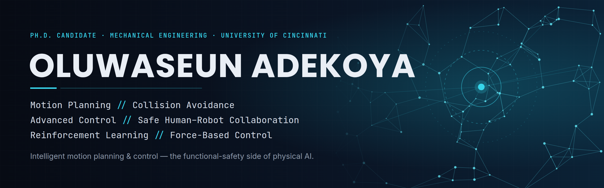

  

  
  
  

---

## 👋 About

I am a Mechanical Engineering **Ph.D. candidate and Robotics Engineer** with 6+ years spanning robotic systems, advanced control, and manufacturing. My work lives where **intelligent control meets real hardware**, across three connected tracks:

- 🤖 **Robotics & Motion Planning** — learning-based planning, collision avoidance, and safe human–robot collaboration for high-DOF manipulators
- 🎛️ **Advanced Control** — Nonlinear MPC, Reinforcement Learning, Dynamic Programming, and impedance control for real dynamic systems
- ⚙️ **Design & Manufacturing** — CAD, prototyping, and Industry 4.0/5.0 process optimization

🎓 Summa Cum Laude & Best Graduating Mechanical Engineer (FUTA, Nigeria) · Based in Cincinnati, OH

---

## 🔬 Current Research

**Dissertation —** *Intelligent Motion Planning and Control for Safe Human-Robot Collaboration Under Motion Uncertainty in Dynamic Environments.*

| Focus area | What it tackles |
|---|---|
| 🧭 **Path Planning** | Sampling-based & human-aware planners (PRM, HAMP) for cluttered, dynamic scenes |
| 🛡️ **Collision Avoidance & Safety** | Speed & separation monitoring, critical-distance-aware avoidance |
| ⚠️ **Danger-Zone Modeling** | Dynamic safety volumes around robot & human |
| 🧠 **RL + NMPC** | Learning-augmented nonlinear predictive control |
| 🤝 **Impedance Control** | Compliant contact for safe physical interaction |

---

## 🛠️ Tech Stack

**Robotics & Control**

**Programming & ML**

**Simulation & CAD**

---

## 📌 Featured Projects

| Project | What it is |
|---|---|
| [**Cartesian Impedance Control — Neuromeka**](https://github.com/ultimatecheun/cartesian-impedance-control-neuromeka) | Compliant impedance control for a 7-DOF robot + stiffness sensitivity study |
| [**Nonlinear MPC — Pendulum**](https://github.com/ultimatecheun/nonlinear-mpc-pendulum) | From-scratch nonlinear Model Predictive Control in MATLAB |
| [**Dynamic Programming — Optimal Control**](https://github.com/ultimatecheun/dynamic-programming-optimal-control) | DP optimal control across mass–damper, single-link & pendulum |
| [**DP for Control Co-Design**](https://github.com/ultimatecheun/dp-control-codesign) | Co-design of plant + controller, batch & HPC workflow |
| [**Schelling Segregation Model**](https://github.com/ultimatecheun/schelling-segregation-model) | Agent-based emergence simulation in Python |

---

## 📄 Selected Publications

📚 **[Full list on Google Scholar →](https://scholar.google.com/citations?hl=en&user=mF_y8V0AAAAJ)**

- **A Comparative Study Between Dynamic Programming and Model Predictive Control for Closed-Loop Control Systems** — *Journal of Mechanical Design*, 2024
- **Experimental Evaluation of RGB-D Sensing for Speed & Separation Monitoring in HRC Work Cells** — *Robotics and Computer-Integrated Manufacturing* (under review)
- **Novel Methodology for 3D Vision-Guided Robotic Fastener Removal** — *Measurement* (under review)
- **Critical Distance-Aware Collision Avoidance Using PRMs and Human-Aware Motion Planners (HAMP)** — *in preparation*

---

## 💼 Experience

| Role | Organization | Period |
|---|---|---|
| Industry Research Engineer | Center for Intelligent Metrology & Sensing, UC | 2026 – Present |
| Production Systems & Reliability Intern | Procter & Gamble | 2024 – 2025 |
| Graduate Researcher | Integrated Vehicle Design Lab, UC | 2021 – 2024 |
| Associate Lead Engineer | Mikano International, Nigeria | 2019 – 2020 |

🏆 Awards &amp; Certifications

 

- 3× NSBE BCA/Fellows Scholarship Award (2023, 2024, 2026)
- Graduate Student Engineer of the Month — CEAS, University of Cincinnati (2024)
- University Research Council Fellowship — UC Office of Research (2024)
- NSF / Future of Semiconductors Fellowship (2024)
- Lean Six Sigma (Yellow Belt) · MATLAB, Simulink &amp; Machine Learning Onramps · Introduction to Self-Driving Vehicles

---

## 📊 GitHub Activity

---

## 🤝 Let's Connect

Open to **robotics, controls, and automation roles — industry, research & development.**

